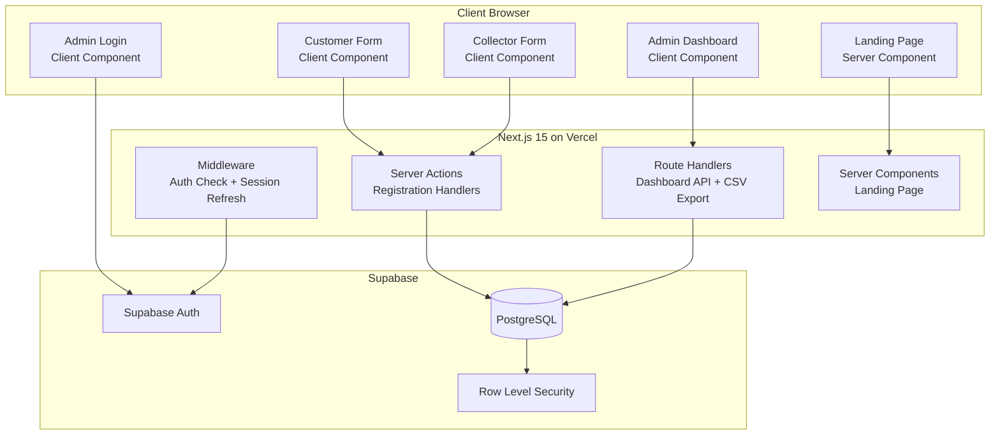
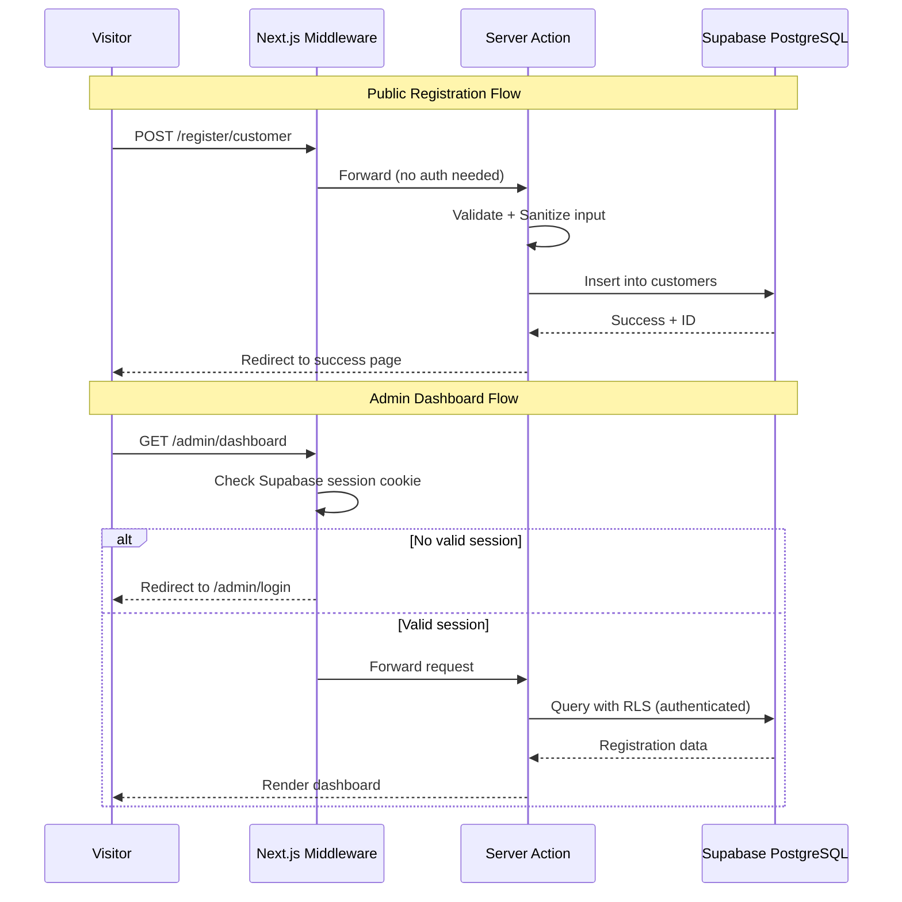
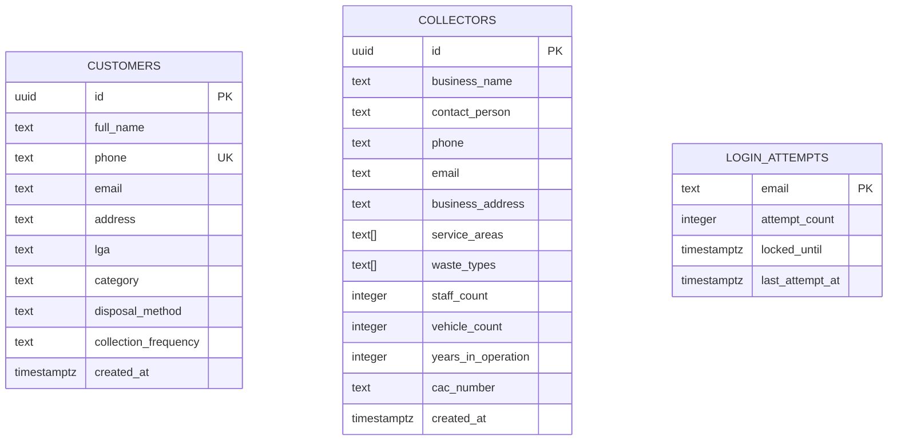

# Design Document: CleanCall MVP

## Overview

CleanCall MVP is a waste management onboarding and registration platform for Ekiti State, Nigeria. It captures demand (customers needing waste collection) and supply (collectors providing services) to validate market potential before building the full CleanCall marketplace.

The system is a Next.js 15 full-stack application using the App Router pattern. Public-facing pages (landing page, registration forms) are server-rendered for performance. The admin dashboard is a protected client-side application behind Supabase Auth. All data persists in Supabase PostgreSQL with Row Level Security (RLS) policies enforcing access control.

**Key Design Decisions:**
- **Next.js App Router** with Server Components for public pages (SEO, performance) and Client Components for interactive forms and admin dashboard
- **Supabase SSR (`@supabase/ssr`)** for cookie-based session management across server and client
- **Server Actions** for form submissions to get server-side validation without separate API routes
- **Route Handlers** for CSV export and dashboard data aggregation endpoints
- **Middleware** for auth session refresh and route protection

## Architecture

### System Architecture Diagram



### Request Flow



### Folder Structure

```
src/
├── app/
│   ├── layout.tsx                    # Root layout with fonts, metadata
│   ├── page.tsx                      # Landing page (Server Component)
│   ├── register/
│   │   ├── customer/
│   │   │   ├── page.tsx             # Customer registration form
│   │   │   └── success/page.tsx     # Success confirmation
│   │   └── collector/
│   │       ├── page.tsx             # Collector registration form
│   │       └── success/page.tsx     # Success confirmation
│   ├── admin/
│   │   ├── login/page.tsx           # Admin login
│   │   ├── layout.tsx               # Admin layout with auth guard
│   │   ├── dashboard/page.tsx       # Dashboard statistics
│   │   └── registrations/
│   │       ├── customers/page.tsx   # Customer table management
│   │       └── collectors/page.tsx  # Collector table management
│   └── api/
│       ├── admin/
│       │   ├── stats/route.ts       # Dashboard statistics endpoint
│       │   ├── customers/route.ts   # Paginated customer data
│       │   ├── collectors/route.ts  # Paginated collector data
│       │   └── export/
│       │       ├── customers/route.ts  # CSV export
│       │       └── collectors/route.ts # CSV export
│       └── auth/
│           └── rate-limit/route.ts  # Rate limiting check
├── lib/
│   ├── supabase/
│   │   ├── client.ts               # Browser Supabase client
│   │   ├── server.ts               # Server Component Supabase client
│   │   └── middleware.ts            # Middleware Supabase client
│   ├── validators/
│   │   ├── customer.ts             # Customer form validation schema
│   │   ├── collector.ts            # Collector form validation schema
│   │   └── auth.ts                 # Login form validation schema
│   ├── constants/
│   │   ├── lgas.ts                 # 16 Ekiti State LGAs
│   │   ├── categories.ts           # Customer categories
│   │   ├── disposal-methods.ts     # Waste disposal methods
│   │   └── frequencies.ts          # Collection frequencies
│   ├── utils/
│   │   ├── sanitize.ts             # Input sanitization
│   │   ├── csv.ts                  # CSV generation utility
│   │   ├── phone.ts                # Nigerian phone validation
│   │   └── rate-limit.ts           # Rate limiting utility
│   └── actions/
│       ├── register-customer.ts    # Customer registration server action
│       ├── register-collector.ts   # Collector registration server action
│       └── auth.ts                 # Login/logout server actions
├── components/
│   ├── ui/                         # shadcn/ui components
│   ├── landing/
│   │   ├── hero.tsx
│   │   ├── about.tsx
│   │   ├── reasons.tsx
│   │   ├── cta-section.tsx
│   │   ├── contact.tsx
│   │   └── footer.tsx
│   ├── forms/
│   │   ├── customer-form.tsx
│   │   ├── collector-form.tsx
│   │   └── login-form.tsx
│   └── admin/
│       ├── stats-cards.tsx
│       ├── recent-registrations.tsx
│       ├── lga-breakdown.tsx
│       ├── registration-table.tsx
│       ├── search-filter-bar.tsx
│       └── export-button.tsx
├── middleware.ts                    # Next.js middleware for auth
└── types/
    └── index.ts                    # Shared TypeScript types
```

## Components and Interfaces

### Public Pages

#### Landing Page (`app/page.tsx`)
- Server Component for optimal LCP performance
- Static content rendered at build time where possible
- Sections: Hero, About, Reasons, Customer CTA, Collector CTA, Contact, Footer
- Links to `/register/customer` and `/register/collector`

#### Customer Registration Form (`components/forms/customer-form.tsx`)
- Client Component using React Hook Form with Zod validation
- Fields: full_name, phone, email (optional), address, lga (dropdown), category (dropdown), disposal_method (dropdown), collection_frequency (dropdown)
- Client-side validation runs on blur and submit
- Server Action handles server-side validation, duplicate phone check, and database insert
- On success: redirect to `/register/customer/success`

#### Collector Registration Form (`components/forms/collector-form.tsx`)
- Client Component using React Hook Form with Zod validation
- Fields: business_name, contact_person, phone, email, business_address, service_areas (multi-select), waste_types (multi-select), staff_count, vehicle_count, years_in_operation, cac_number (optional)
- Numeric fields validated as positive integers within bounds
- Server Action handles validation and insert
- On success: redirect to `/register/collector/success`

### Admin Authentication

#### Login Form (`components/forms/login-form.tsx`)
- Client Component with email/password fields
- Rate limiting: 5 failed attempts per email → 15-minute lockout
- Rate limit tracked server-side using Supabase table or in-memory store
- Generic error messages (no email/password distinction)
- On success: redirect to `/admin/dashboard`

#### Auth Middleware (`middleware.ts`)
- Runs on all `/admin/*` routes except `/admin/login`
- Refreshes Supabase session cookie on each request
- Redirects unauthenticated users to `/admin/login`

### Admin Dashboard

#### Statistics Page (`app/admin/dashboard/page.tsx`)
- Displays: total customers, total collectors, recent 10 registrations, LGA breakdown
- Data fetched via Route Handlers with authenticated Supabase client
- Empty state handling for zero registrations

#### Registration Management (`app/admin/registrations/customers/page.tsx`)
- Paginated table (20 rows default) with server-side pagination
- Search: case-insensitive partial match on name/phone/email/address (minimum 2 characters)
- Filters: LGA dropdown, category dropdown (customers only)
- Combined filters use AND logic
- Sort: `created_at` descending by default
- Empty state for no matching records

#### CSV Export (`components/admin/export-button.tsx`)
- Triggers Route Handler to generate CSV
- Applies current active filters to export
- Streams response as file download
- 30-second timeout with error handling and retry
- File naming: `{view}_export_{YYYY-MM-DD}.csv`

### Shared Utilities

#### Validation (`lib/validators/`)
- Zod schemas shared between client and server
- Nigerian phone: `^0[7-9][01]\d{8}$` or `^\+234[7-9][01]\d{8}$`
- Email: standard RFC 5322 simplified pattern
- String lengths enforced per requirements
- Enum values for dropdowns match constants

#### Sanitization (`lib/utils/sanitize.ts`)
- Strip HTML tags from all string inputs
- Escape special characters for SQL injection prevention (handled by Supabase parameterized queries)
- Trim whitespace from all fields
- Normalize phone numbers to consistent format

#### Rate Limiting (`lib/utils/rate-limit.ts`)
- Track failed login attempts per email address
- Storage: Supabase `login_attempts` table with email, attempt_count, locked_until, last_attempt_at
- Check before authentication, increment on failure, reset on success
- 15-minute lockout after 5 consecutive failures

### API Interfaces

#### Server Actions

```typescript
// Register Customer
async function registerCustomer(formData: FormData): Promise<ActionResult>

// Register Collector
async function registerCollector(formData: FormData): Promise<ActionResult>

// Admin Login
async function loginAdmin(formData: FormData): Promise<ActionResult>

// Admin Logout
async function logoutAdmin(): Promise<void>
```

#### Route Handlers

```typescript
// GET /api/admin/stats
// Returns: { customerCount, collectorCount, recentRegistrations[], lgaBreakdown[] }

// GET /api/admin/customers?page=1&pageSize=20&search=&lga=&category=
// Returns: { data: Customer[], total: number, page: number, pageSize: number }

// GET /api/admin/collectors?page=1&pageSize=20&search=&lga=
// Returns: { data: Collector[], total: number, page: number, pageSize: number }

// GET /api/admin/export/customers?lga=&category=&search=
// Returns: CSV file stream

// GET /api/admin/export/collectors?lga=&search=
// Returns: CSV file stream
```

## Data Models

### Database Schema



### SQL Schema

```sql
-- Customers table
CREATE TABLE customers (
    id UUID PRIMARY KEY DEFAULT gen_random_uuid(),
    full_name TEXT NOT NULL CHECK (char_length(full_name) BETWEEN 1 AND 100),
    phone TEXT NOT NULL UNIQUE CHECK (phone ~ '^(0[7-9][01]\d{8}|\+234[7-9][01]\d{8})$'),
    email TEXT CHECK (email ~ '^[^@]+@[^@]+\.[^@]+$'),
    address TEXT NOT NULL CHECK (char_length(address) BETWEEN 1 AND 255),
    lga TEXT NOT NULL CHECK (lga IN (
        'Ado-Ekiti', 'Ikere', 'Oye', 'Ikole', 'Ekiti East',
        'Ekiti West', 'Emure', 'Ise/Orun', 'Irepodun/Ifelodun',
        'Ijero', 'Efon', 'Ekiti South-West', 'Gbonyin',
        'Ido-Osi', 'Moba', 'Ilejemeje'
    )),
    category TEXT NOT NULL CHECK (category IN (
        'Household', 'Business', 'School', 'Religious Organization', 'Other'
    )),
    disposal_method TEXT NOT NULL CHECK (disposal_method IN (
        'Burning', 'Burying', 'Roadside Dumping',
        'Private Collector', 'Government Collector', 'Other'
    )),
    collection_frequency TEXT NOT NULL CHECK (collection_frequency IN (
        'Daily', 'Twice a Week', 'Weekly', 'Bi-Weekly', 'Monthly'
    )),
    created_at TIMESTAMPTZ NOT NULL DEFAULT now()
);

-- Collectors table
CREATE TABLE collectors (
    id UUID PRIMARY KEY DEFAULT gen_random_uuid(),
    business_name TEXT NOT NULL CHECK (char_length(business_name) BETWEEN 1 AND 150),
    contact_person TEXT NOT NULL CHECK (char_length(contact_person) BETWEEN 1 AND 100),
    phone TEXT NOT NULL CHECK (phone ~ '^(0[7-9][01]\d{8}|\+234[7-9][01]\d{8})$'),
    email TEXT NOT NULL CHECK (email ~ '^[^@]+@[^@]+\.[^@]+$'),
    business_address TEXT NOT NULL CHECK (char_length(business_address) BETWEEN 1 AND 300),
    service_areas TEXT[] NOT NULL CHECK (array_length(service_areas, 1) BETWEEN 1 AND 16),
    waste_types TEXT[] NOT NULL,
    staff_count INTEGER NOT NULL CHECK (staff_count BETWEEN 1 AND 10000),
    vehicle_count INTEGER NOT NULL CHECK (vehicle_count BETWEEN 1 AND 10000),
    years_in_operation INTEGER NOT NULL CHECK (years_in_operation BETWEEN 0 AND 100),
    cac_number TEXT CHECK (cac_number IS NULL OR char_length(cac_number) <= 20),
    created_at TIMESTAMPTZ NOT NULL DEFAULT now()
);

-- Login attempts tracking for rate limiting
CREATE TABLE login_attempts (
    email TEXT PRIMARY KEY,
    attempt_count INTEGER NOT NULL DEFAULT 0,
    locked_until TIMESTAMPTZ,
    last_attempt_at TIMESTAMPTZ NOT NULL DEFAULT now()
);

-- Indexes for performance
CREATE INDEX idx_customers_created_at ON customers(created_at DESC);
CREATE INDEX idx_customers_lga ON customers(lga);
CREATE INDEX idx_customers_phone ON customers(phone);
CREATE INDEX idx_customers_category ON customers(category);
CREATE INDEX idx_collectors_created_at ON collectors(created_at DESC);
CREATE INDEX idx_collectors_service_areas ON collectors USING GIN(service_areas);

-- Full-text search indexes for admin search
CREATE INDEX idx_customers_search ON customers USING GIN(
    to_tsvector('english', full_name || ' ' || phone || ' ' || COALESCE(email, '') || ' ' || address)
);
CREATE INDEX idx_collectors_search ON collectors USING GIN(
    to_tsvector('english', business_name || ' ' || contact_person || ' ' || phone || ' ' || email || ' ' || business_address)
);
```

### Row Level Security Policies

```sql
-- Enable RLS on all tables
ALTER TABLE customers ENABLE ROW LEVEL SECURITY;
ALTER TABLE collectors ENABLE ROW LEVEL SECURITY;
ALTER TABLE login_attempts ENABLE ROW LEVEL SECURITY;

-- Public can INSERT into customers and collectors (registration)
CREATE POLICY "Allow public insert" ON customers
    FOR INSERT TO anon WITH CHECK (true);

CREATE POLICY "Allow public insert" ON collectors
    FOR INSERT TO anon WITH CHECK (true);

-- Only authenticated admins can SELECT from customers and collectors
CREATE POLICY "Admin select customers" ON customers
    FOR SELECT TO authenticated USING (true);

CREATE POLICY "Admin select collectors" ON collectors
    FOR SELECT TO authenticated USING (true);

-- Login attempts managed by service role only (server-side)
CREATE POLICY "Service role only" ON login_attempts
    FOR ALL TO service_role USING (true);
```

### TypeScript Types

```typescript
// Customer registration input
interface CustomerRegistrationInput {
    full_name: string;
    phone: string;
    email?: string;
    address: string;
    lga: EkitiLGA;
    category: CustomerCategory;
    disposal_method: DisposalMethod;
    collection_frequency: CollectionFrequency;
}

// Collector registration input
interface CollectorRegistrationInput {
    business_name: string;
    contact_person: string;
    phone: string;
    email: string;
    business_address: string;
    service_areas: EkitiLGA[];
    waste_types: string[];
    staff_count: number;
    vehicle_count: number;
    years_in_operation: number;
    cac_number?: string;
}

// Database row types (includes auto-generated fields)
interface Customer extends CustomerRegistrationInput {
    id: string;
    created_at: string;
}

interface Collector extends CollectorRegistrationInput {
    id: string;
    created_at: string;
}

// Enum types
type EkitiLGA =
    | 'Ado-Ekiti' | 'Ikere' | 'Oye' | 'Ikole' | 'Ekiti East'
    | 'Ekiti West' | 'Emure' | 'Ise/Orun' | 'Irepodun/Ifelodun'
    | 'Ijero' | 'Efon' | 'Ekiti South-West' | 'Gbonyin'
    | 'Ido-Osi' | 'Moba' | 'Ilejemeje';

type CustomerCategory =
    | 'Household' | 'Business' | 'School' | 'Religious Organization' | 'Other';

type DisposalMethod =
    | 'Burning' | 'Burying' | 'Roadside Dumping'
    | 'Private Collector' | 'Government Collector' | 'Other';

type CollectionFrequency =
    | 'Daily' | 'Twice a Week' | 'Weekly' | 'Bi-Weekly' | 'Monthly';

// API response types
interface PaginatedResponse<T> {
    data: T[];
    total: number;
    page: number;
    pageSize: number;
}

interface DashboardStats {
    customerCount: number;
    collectorCount: number;
    recentRegistrations: RecentRegistration[];
    lgaBreakdown: LGABreakdownItem[];
}

interface RecentRegistration {
    name: string;
    role: 'Customer' | 'Collector';
    lga: string;
    created_at: string;
}

interface LGABreakdownItem {
    lga: EkitiLGA;
    customerCount: number;
    collectorCount: number;
}

interface ActionResult {
    success: boolean;
    error?: string;
    fieldErrors?: Record<string, string>;
}
```

## Correctness Properties

*A property is a characteristic or behavior that should hold true across all valid executions of a system — essentially, a formal statement about what the system should do. Properties serve as the bridge between human-readable specifications and machine-verifiable correctness guarantees.*

### Property 1: Registration Data Persistence Round-Trip

*For any* valid customer or collector registration input, submitting the data through the server action and then querying the database by the returned ID SHALL produce a record with field values identical to the original input (excluding auto-generated `id` and `created_at`).

**Validates: Requirements 2.2, 3.2**

### Property 2: Phone Number Validation Rejects Invalid Formats

*For any* string that does not match the pattern of 11 digits starting with `0[7-9][01]` or 13 digits starting with `+234[7-9][01]`, the phone validation function SHALL return an error and the registration SHALL be rejected.

**Validates: Requirements 2.5, 3.5**

### Property 3: Enum Field Validation Rejects Invalid Values

*For any* string not present in the defined set of allowed values for a restricted field (LGA, category, disposal_method, collection_frequency, service_areas items), the validation function SHALL reject the input and return a field-specific error.

**Validates: Requirements 2.6, 2.7, 2.8, 2.9, 3.7, 3.8**

### Property 4: Required Field Validation Identifies All Missing Fields

*For any* subset of required registration fields left empty or omitted, the validation function SHALL return errors for exactly those fields that are missing, and no other fields SHALL be flagged.

**Validates: Requirements 2.4, 3.4**

### Property 5: Duplicate Phone Detection

*For any* valid customer registration that has been successfully stored, a subsequent registration attempt with the same phone number SHALL be rejected with an error indicating the phone is already registered.

**Validates: Requirements 2.10**

### Property 6: Rate Limiting Threshold

*For any* email address, after exactly 5 consecutive failed login attempts the system SHALL lock that email for 15 minutes, and for fewer than 5 consecutive failures the system SHALL allow further attempts.

**Validates: Requirements 4.8**

### Property 7: Admin Route Protection

*For any* request to an admin API endpoint or admin page that lacks a valid authenticated session, the system SHALL respond with a 401 status or redirect to the login page, returning no registration data.

**Validates: Requirements 4.4, 8.2**

### Property 8: Combined Search and Filter Correctness

*For any* combination of search query (≥2 characters) and filter selections (LGA, category) applied to a dataset of registrations, every record in the result set SHALL satisfy ALL active conditions simultaneously: the search query appears as a case-insensitive substring in at least one of name/phone/email/address, AND the record matches all selected filter values.

**Validates: Requirements 6.3, 6.4, 6.5, 6.8**

### Property 9: Pagination Correctness

*For any* dataset of N registration records with page size 20, page P SHALL contain exactly `min(20, N - (P-1)*20)` records, the total count SHALL equal N, and the union of all pages SHALL equal the full dataset with no duplicates or omissions.

**Validates: Requirements 6.6**

### Property 10: CSV Serialization Round-Trip

*For any* set of registration records (including field values containing commas, double quotes, and newlines), generating a CSV export and parsing it back SHALL produce records with values identical to the original data, with all fields in the specified column order.

**Validates: Requirements 7.1, 7.2, 7.3**

### Property 11: Input Sanitization Preserves Data Integrity

*For any* user-provided string input containing HTML tags or script content, the sanitization function SHALL remove or escape potentially dangerous content while preserving the semantic text content (non-HTML characters remain unchanged).

**Validates: Requirements 8.5**

### Property 12: Server-Side Validation Rejects Invalid Payloads

*For any* registration payload sent directly to the API with at least one field violating type, format, or constraint requirements, the server SHALL respond with HTTP 400 and an error body identifying the invalid fields, and SHALL NOT persist any data.

**Validates: Requirements 8.4, 8.6**

### Property 13: Dashboard Statistics Accuracy

*For any* set of customer and collector records stored in the database, the dashboard statistics endpoint SHALL return a customer count equal to the number of customer records, a collector count equal to the number of collector records, and an LGA breakdown where the sum of all LGA counts equals the total record count.

**Validates: Requirements 5.1, 5.2, 5.4, 5.5**

### Property 14: Form Inputs Have Accessible Labels

*For any* form input element rendered on any registration or login form, there SHALL exist an associated visible label (via `<label for="">` or `aria-labelledby`) such that assistive technologies can announce the field purpose when it receives focus.

**Validates: Requirements 10.3**

## Error Handling

### Client-Side Errors

| Scenario | Handling |
|----------|----------|
| Form validation failure | Inline error messages below each invalid field, field highlighted with error styling (not color-only), ARIA live region announcement |
| Network timeout/failure | Toast notification with "Connection error. Please try again." message and retry option |
| Unexpected client error | Error boundary catches React errors, displays friendly fallback UI |

### Server-Side Errors

| Scenario | HTTP Status | Response |
|----------|-------------|----------|
| Validation failure | 400 | `{ success: false, fieldErrors: { field: "message" } }` |
| Duplicate phone | 409 | `{ success: false, error: "Phone number already registered" }` |
| Unauthenticated request | 401 | `{ error: "Unauthorized" }` (no data leaked) |
| Rate limited | 429 | `{ error: "Too many attempts. Try again in X minutes." }` |
| Database error | 500 | `{ error: "An unexpected error occurred. Please try again." }` (no internal details) |
| CSV export timeout | 504 | `{ error: "Export timed out. Please try again or narrow your filters." }` |

### Error Handling Principles

1. **Generic error messages for auth**: Never reveal whether email or password was incorrect
2. **No internal details in production**: Stack traces, SQL errors, and system paths are logged server-side only
3. **Graceful degradation**: If Supabase is temporarily unavailable, show appropriate error without crashing
4. **Form state preservation**: On error, never clear already-filled form fields
5. **Retry guidance**: When appropriate, inform users they can retry or suggest narrowing their request (e.g., CSV export)

## Testing Strategy

### Testing Approach

This project uses a dual testing approach:
- **Property-based tests** verify universal correctness properties across random inputs (validation logic, CSV serialization, search/filter, rate limiting)
- **Unit tests** verify specific examples, edge cases, and integration points
- **Integration tests** verify end-to-end flows with Supabase

### Testing Libraries

- **Vitest**: Test runner and assertion library
- **fast-check**: Property-based testing library for TypeScript
- **Testing Library (React)**: Component rendering and interaction testing
- **MSW (Mock Service Worker)**: API mocking for integration tests

### Property-Based Tests

Each correctness property from the design document is implemented as a property-based test using `fast-check`:

- Minimum **100 iterations** per property test
- Each test tagged with: `Feature: cleancall-mvp, Property {number}: {title}`
- Properties test pure validation/transformation functions directly (no network/DB)
- For properties requiring DB state (e.g., duplicate detection, statistics accuracy), use test database with seeded data

**Property test targets:**
1. `lib/validators/customer.ts` — Properties 2, 3, 4
2. `lib/validators/collector.ts` — Properties 2, 3, 4
3. `lib/utils/phone.ts` — Property 2
4. `lib/utils/csv.ts` — Property 10
5. `lib/utils/sanitize.ts` — Property 11
6. `lib/utils/rate-limit.ts` — Property 6
7. `app/api/admin/*/route.ts` — Properties 7, 8, 9, 12, 13

### Unit Tests

- Registration form rendering (all fields present, correct types)
- Success/error page rendering
- Login form validation (empty fields edge case)
- Dashboard empty state handling
- CSV filename generation
- LGA constants completeness (exactly 16)

### Integration Tests

- Full customer registration flow (submit → DB → success page)
- Full collector registration flow
- Admin login → dashboard → view registrations → export flow
- RLS policy verification (anon can insert, only authenticated can select)
- Rate limiting end-to-end (5 failures → lockout → unlock after 15 min)

### Test Organization

```
tests/
├── properties/
│   ├── validation.property.test.ts    # Properties 2, 3, 4
│   ├── csv.property.test.ts           # Property 10
│   ├── sanitize.property.test.ts      # Property 11
│   ├── rate-limit.property.test.ts    # Property 6
│   ├── search-filter.property.test.ts # Properties 8, 9
│   └── stats.property.test.ts        # Property 13
├── unit/
│   ├── forms/
│   ├── components/
│   └── utils/
└── integration/
    ├── registration.test.ts
    ├── auth.test.ts
    └── admin.test.ts
```

