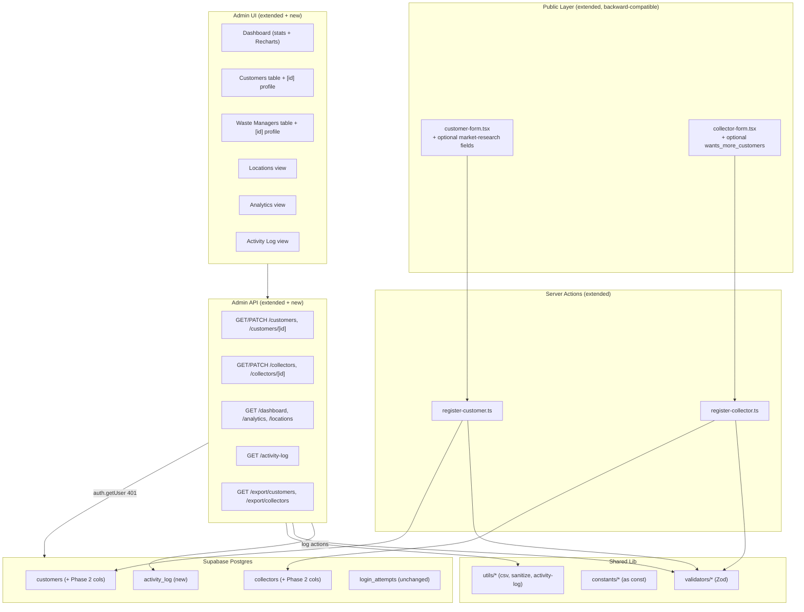
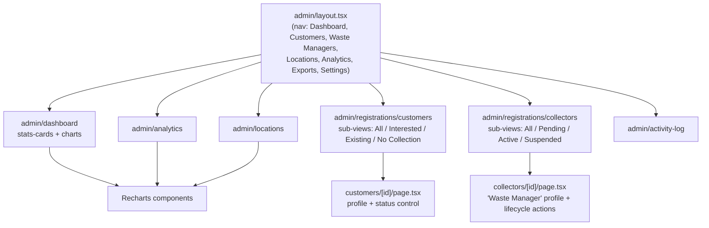
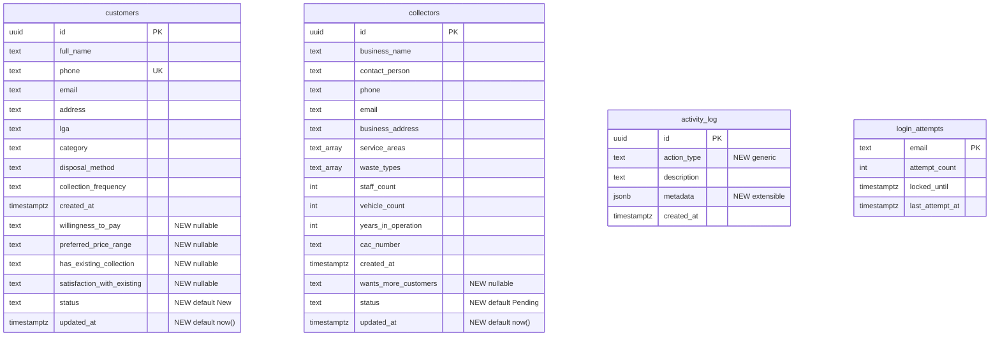

# Design Document: CleanCall Phase 2 — Platform Database & Admin Operations Dashboard

## Overview

Phase 2 is an **additive, non-destructive extension** of the live CleanCall Phase 1 application. It does not rebuild any existing functionality. The design layers new market-research capture onto the existing registration forms, expands the admin dashboard into an operations console, and introduces "Waste Manager" as a display-only synonym for the existing `collectors` entity.

The single most important design constraint is **backward compatibility** (Requirement 1, Requirement 17.2): the ~99 existing records must be preserved, every new database column must be nullable with sensible defaults, and every new feature must reuse the Phase 1 Supabase client, `@supabase/ssr` auth, Zod validation pattern, shadcn/ui components, and styling conventions.

The design follows the exact conventions verified in the Phase 1 codebase:

- **Migrations** are raw SQL files in `supabase/migrations/` (existing: `001_initial_schema.sql`). Phase 2 adds `002_phase2_admin.sql`.
- **API routes** under `src/app/api/admin/*` follow the pattern: `createClient()` → `auth.getUser()` → `401` if no user → parse `searchParams` → build a Supabase query with `.or()`/`.eq()`/`.contains()`/`.order()`/`.range()` → return `PaginatedResponse<T>` or a typed payload.
- **Server actions** in `src/lib/actions/*` use `"use server"`, extract `FormData`, `safeParse` with a Zod schema, `sanitizeRegistrationData`, then insert via Supabase, returning `ActionResult`.
- **Constants** in `src/lib/constants/*` use `as const` + a derived type + a barrel `index.ts`.
- **Validators** in `src/lib/validators/*` are Zod schemas that infer their input type.
- **Types** live in `src/types/index.ts`.
- **Forms** use React Hook Form + `zodResolver` + `useTransition` + native `select`/`checkbox` with ARIA attributes.

### Research Notes: Charting Library

Phase 1 has **no charting library** installed (verified in `package.json`). Requirement 7 requires charts for registrations-over-time, customers-vs-managers, by-LGA, willingness-to-pay, and existing-collection distributions.

**Decision: Add [Recharts](https://recharts.org) as a new dependency.**

Rationale (content rephrased for compliance):
- Recharts is a composable charting library built specifically on React components, which matches the existing React 19 / component-driven codebase and avoids imperative canvas wiring.
- It ships responsive containers (`ResponsiveContainer`) that satisfy the 320px–1920px no-horizontal-scroll requirement (Requirement 17.3) without custom resize logic.
- It is lightweight relative to full dashboards like Chart.js wrappers and supports bar, line, and pie charts — exactly the simple chart types Requirement 7 needs.

This is the **only new runtime dependency** introduced by Phase 2. It must be pinned: `recharts` at a fixed version (e.g. `^2.x`) added to `package.json`.

Sources: [Recharts documentation](https://recharts.org/en-US/) — *Content was rephrased for compliance with licensing restrictions.*

## Architecture

Phase 2 preserves the Phase 1 layered architecture and adds new slices within each layer.



**Auth & authorization** (Requirement 16): all Phase 2 admin pages remain behind the existing `src/lib/supabase/middleware.ts` route guard; every Phase 2 API route repeats the `auth.getUser()` → `401` check before returning or mutating data. No new public endpoints expose registration detail data (Requirement 16.5).

**Activity logging** is centralized in a new server-side helper (`src/lib/utils/activity-log.ts`) so that status changes, approvals, suspensions, logins, and exports all record entries through one code path (Requirement 14).

### Admin Authorization Model (Important Security Note)

This subsection documents exactly how admin authorization works **today**, based on the verified Phase 1 RLS policies. It is intentionally explicit because the current posture is safe only under a specific precondition.

**Verified Phase 1 RLS policies:**

- `customers` and `collectors`: `FOR SELECT TO authenticated USING (true)` and `FOR INSERT TO anon WITH CHECK (true)`.
- `login_attempts`: `FOR ALL TO service_role`.

**How authorization actually works today.** The system currently treats **any authenticated Supabase Auth user as an Admin**. This is correct today only because there is **no non-admin login path** in the application: the only way for a session to become `authenticated` is to log in through the admin login flow. Public registration uses the anonymous (`anon`) role and never produces an authenticated session. So the identity "authenticated == admin" holds **solely as a consequence of there being no other authenticated user type** — it is not enforced by a role check, an `admins` table, or a JWT claim.

**SECURITY PRECONDITION FOR FUTURE PHASES (hard requirement, not optional).** If any future phase introduces non-admin authenticated users (for example, customer logins or collector/Waste Manager logins), the current `USING (true)` policies on `customers` and `collectors` **MUST be replaced with role/claim-scoped policies** (for example, checking a JWT claim such as `auth.jwt() ->> 'role'`, or membership in a dedicated `admins` table) **BEFORE** any such login is enabled. Enabling a second authenticated user type without first tightening these policies would expose all registration data to those users. This is a hard precondition on future work, not a suggestion.

**Phase 2 does not regress this posture.** Phase 2 introduces **no** non-admin login path — it only extends the existing admin console and public (anonymous) registration. Therefore the "authenticated == admin" assumption remains valid throughout Phase 2, and no change to the existing `customers`/`collectors` policies is required for Phase 2 itself.

## Components and Interfaces

### New Constants (`src/lib/constants/`)

Each follows the `as const` + derived type + barrel export pattern. All are display-safe and used both by Zod enums and by form `<option>` rendering.

| File | Export | Values |
|------|--------|--------|
| `willingness-to-pay.ts` | `WILLINGNESS_TO_PAY` | `Yes`, `Maybe - Depends on price`, `No` |
| `price-ranges.ts` | `PRICE_RANGES` | `Below ₦2,000`, `₦2,000–₦5,000`, `₦5,000–₦10,000`, `Above ₦10,000`, `Not sure` |
| `existing-collection.ts` | `EXISTING_COLLECTION_OPTIONS` | `Yes`, `No`, `Sometimes`, `I manage it myself` |
| `satisfaction.ts` | `SATISFACTION_OPTIONS` | `Yes`, `No`, `Somewhat` |
| `customer-status.ts` | `CUSTOMER_STATUSES` | `New`, `Contacted`, `Interested`, `Converted`, `Inactive` |
| `provider-status.ts` | `PROVIDER_STATUSES` | `Pending`, `Contacted`, `Verified`, `Active`, `Inactive`, `Suspended`, `Rejected` |
| `wants-more-customers.ts` | `WANTS_MORE_CUSTOMERS` | `Yes`, `Maybe`, `No` |

`src/lib/constants/index.ts` re-exports each constant and its derived type. (Requirements 2.2–2.5, 3.2, 4.2, 4.4)

### Terminology Mapping (`src/lib/utils/terminology.ts`)

A small display-only mapping so the UI shows "Waste Manager" without touching table names, column names, or code identifiers (Requirement 1.1, Requirements 10, 11).

```ts
export const TERMINOLOGY = {
  collector: "Waste Manager",
  collectors: "Waste Managers",
} as const;

export function displayEntity(key: keyof typeof TERMINOLOGY): string {
  return TERMINOLOGY[key];
}
```

This is a pure lookup — no data migration, no identifier rename.

### Activity Log Helper (`src/lib/utils/activity-log.ts`)

A server-side helper that inserts into `activity_log`. Because the `activity_log` INSERT policy permits **`service_role` only** (see RLS below), all writes go through a **server-side client with service-role privileges**. The helper accepts the Supabase client at the call site so the service client is passed for every insert; the `authenticated` admin session is used only for reads (dashboard). Keeping writes on the service role means the RLS policy — not the caller — is the single source of truth for who may append to the audit log.

```ts
import type { SupabaseClient } from "@supabase/supabase-js";

export type ActivityActionType =
  | "admin_login"
  | "customer_status_change"
  | "provider_approval"
  | "provider_suspension"
  | "provider_status_change"
  | "data_export";

export async function recordActivity(
  client: SupabaseClient,
  actionType: ActivityActionType,
  description: string,
  metadata: Record<string, unknown> = {}
): Promise<void> {
  await client.from("activity_log").insert({
    action_type: actionType,
    description,
    metadata,
  });
}
```

The `action_type` is a plain `TEXT` column (not a DB enum) so future event types can be recorded without a schema change (Requirement 19.3). Failures to log are non-fatal to the primary operation (logged server-side, never surfaced as a 500 for the main action) so activity logging never breaks a status change or export.

### Validators (`src/lib/validators/`)

**Extended registration schemas** — new fields are added as `.optional()` so omitting them still validates (Requirements 1.5, 2.8, 4.5). Existing fields are untouched.

```ts
// customer.ts additions
willingness_to_pay: z.enum(WILLINGNESS_TO_PAY).optional(),
preferred_price_range: z.enum(PRICE_RANGES).optional(),
has_existing_collection: z.enum(EXISTING_COLLECTION_OPTIONS).optional(),
satisfaction_with_existing: z.enum(SATISFACTION_OPTIONS).optional(),
```

The conditional rule — satisfaction is only meaningful when `has_existing_collection === "Yes"` (Requirements 2.6, 2.7) — is enforced with a `.superRefine`/`.transform` that **nulls out** `satisfaction_with_existing` whenever `has_existing_collection !== "Yes"`, rather than rejecting the submission (a market-research form should never hard-fail on this):

```ts
.transform((data) => ({
  ...data,
  satisfaction_with_existing:
    data.has_existing_collection === "Yes"
      ? data.satisfaction_with_existing
      : undefined,
}))
```

```ts
// collector.ts addition
wants_more_customers: z.enum(WANTS_MORE_CUSTOMERS).optional(),
```

**New status-change schemas** (`src/lib/validators/status.ts`) for PATCH payloads:

```ts
export const customerStatusSchema = z.object({
  status: z.enum(CUSTOMER_STATUSES),
});

export const providerStatusSchema = z.object({
  status: z.enum(PROVIDER_STATUSES),
});
```

Any value outside the enum fails `safeParse`, which the API translates to a `400` with `fieldErrors` and no mutation (Requirements 3.4, 5.2, 16.3, 16.4).

### API Routes

All follow the Phase 1 auth pattern. New/extended routes:

| Route | Method | Purpose | Requirements |
|-------|--------|---------|--------------|
| `/api/admin/customers` | GET | Extend filters: `willingness_to_pay`, `has_existing_collection`, `status`, `dateFrom`, `dateTo` | 8.2, 8.4, 8.5, 8.6, 15.4 |
| `/api/admin/customers/[id]` | GET | Single customer detail | 9.1, 9.4 |
| `/api/admin/customers/[id]` | PATCH | Change `status` (Zod validated) + activity log | 3.3, 3.4, 3.5, 16.3, 16.4 |
| `/api/admin/collectors` | GET | Extend filters: `status`, `wants_more_customers` | 10.2, 15.5 |
| `/api/admin/collectors/[id]` | GET | Single detail | 11.1, 11.4 |
| `/api/admin/collectors/[id]` | PATCH | Change `status` + lifecycle actions (verify/approve/suspend/contact) + activity log | 5.1–5.6, 10.5 |
| `/api/admin/dashboard` | GET | Expanded overview stats | 6.1–6.7 |
| `/api/admin/analytics` | GET | Chart datasets | 7.1–7.7 |
| `/api/admin/locations` | GET | LGA breakdown for customers + service-area coverage | 12.1–12.4 |
| `/api/admin/activity-log` | GET | Activity entries, `created_at DESC` | 14.4 |
| `/api/admin/export/customers` | GET | Add Phase 2 columns, respect filters, log export | 13.1, 13.3, 13.4, 13.5 |
| `/api/admin/export/collectors` | GET | Add Phase 2 columns, respect filters, log export | 13.2, 13.3, 13.4, 13.5 |

**Existing stats route** (`/api/admin/stats`) is retained for Phase 1 compatibility; the new `/api/admin/dashboard` returns the expanded shape so the existing dashboard components keep working during rollout.

**Filter semantics** (Requirement 8.5): a Phase 2 filter is only applied when it specifies a non-null value (`.eq()` is added only when the query param is present). Null field values are naturally excluded by `.eq()` but never cause errors. Date range uses `.gte("created_at", dateFrom)` / `.lte("created_at", dateTo)`.

**PATCH pattern** (customers example):

```ts
export async function PATCH(request, { params }) {
  const supabase = await createClient();
  const { data: { user } } = await supabase.auth.getUser();
  if (!user) return NextResponse.json({ error: "Unauthorized" }, { status: 401 });

  const body = await request.json();
  const parsed = customerStatusSchema.safeParse(body);
  if (!parsed.success) {
    return NextResponse.json(
      { error: "Validation failed", fieldErrors: /* from issues */ },
      { status: 400 }
    );
  }

  const { data, error } = await supabase
    .from("customers")
    .update({ status: parsed.data.status })   // updated_at set by DB trigger
    .eq("id", params.id)
    .select()
    .single();

  if (error) return NextResponse.json({ error: "..." }, { status: 500 });

  // Activity writes go through the service-role client (activity_log INSERT is service_role only).
  await recordActivity(serviceClient, "customer_status_change",
    `Customer ${params.id} status changed to ${parsed.data.status}`,
    { customerId: params.id, newStatus: parsed.data.status });

  return NextResponse.json(data);
}
```

The collector PATCH accepts either a raw `status` or a named `action` (`approve` → `Active`, `suspend` → `Suspended`, `verify` → `Verified`, `contact` → `Contacted`), mapping the action to the target status server-side and logging the appropriate `action_type` (Requirements 5.3–5.6).

### Admin UI Pages & Components



- **Expanded dashboard**: reuses `stats-cards.tsx` (extended props for new counts) + new chart components.
- **Chart components** (`src/components/admin/charts/`): `registrations-over-time.tsx` (line), `customers-vs-managers.tsx` (**bar chart — required, not a pie chart**, per Requirement 7.2), `by-lga.tsx` (bar), `willingness-to-pay.tsx` (pie), `existing-collection.tsx` (pie), each wrapped in `ResponsiveContainer`. Pie charts are used **only** for the willingness-to-pay and existing-collection distribution charts; the customers-vs-managers comparison MUST be rendered as a bar chart.
- **Customer detail** `src/app/admin/registrations/customers/[id]/page.tsx`: sections for personal info, location, waste info, current collection arrangement, market interest, status — with a `NotRecorded` indicator for null fields (Requirements 9.1, 9.2) and a status-change control (Requirement 9.3).
- **Waste manager detail** `src/app/admin/registrations/collectors/[id]/page.tsx`: business/service/status/marketplace sections using "Waste Manager" labels via `terminology.ts` (Requirement 11).
- **Status controls**: a shared `status-control.tsx` (dropdown for customers, action buttons for managers) that PATCHes then triggers `router.refresh()` (refetch update, consistent with the Phase 1 server-component data flow).
- **Locations view** `src/app/admin/locations/page.tsx`: table + simple charts, all 16 LGAs including zeros (Requirement 12).
- **Analytics view** `src/app/admin/analytics/page.tsx`: chart-focused; may reuse the same chart components as the dashboard.
- **Activity log view**: table ordered `created_at DESC`.
- **Navigation** (`layout.tsx`): extend `navLinks` to the seven top-level areas with sub-views for Customers and Waste Managers (Requirement 15). Sub-views map to query params (e.g. `?willingness=interested`, `?status=Pending`) consumed by the extended list routes (Requirements 15.4, 15.5).
- **Reused components**: `registration-table.tsx`, `search-filter-bar.tsx`, `export-button.tsx` gain extended props (new columns, new filter fields, extended export query string) rather than being rewritten (Requirements 8.3, 10.4, 17.2).

## Data Models

### Migration `002_phase2_admin.sql` (non-destructive)

The migration only **adds** — no `DROP`, no `RENAME`, no type changes to existing columns. It uses `IF NOT EXISTS` / `ADD COLUMN IF NOT EXISTS` for idempotency.

**1. New nullable columns on `customers`** (Requirements 1.2, 1.3, 2.1, 3.1, 19.1):

```sql
ALTER TABLE customers ADD COLUMN IF NOT EXISTS willingness_to_pay TEXT
    CHECK (willingness_to_pay IN ('Yes', 'Maybe - Depends on price', 'No'));
ALTER TABLE customers ADD COLUMN IF NOT EXISTS preferred_price_range TEXT
    CHECK (preferred_price_range IN ('Below ₦2,000', '₦2,000–₦5,000', '₦5,000–₦10,000', 'Above ₦10,000', 'Not sure'));
ALTER TABLE customers ADD COLUMN IF NOT EXISTS has_existing_collection TEXT
    CHECK (has_existing_collection IN ('Yes', 'No', 'Sometimes', 'I manage it myself'));
ALTER TABLE customers ADD COLUMN IF NOT EXISTS satisfaction_with_existing TEXT
    CHECK (satisfaction_with_existing IN ('Yes', 'No', 'Somewhat'));
ALTER TABLE customers ADD COLUMN IF NOT EXISTS status TEXT
    CHECK (status IN ('New', 'Contacted', 'Interested', 'Converted', 'Inactive')) DEFAULT 'New';
ALTER TABLE customers ADD COLUMN IF NOT EXISTS updated_at TIMESTAMPTZ DEFAULT now();
```

All CHECK constraints allow `NULL` (a Postgres CHECK passes when the expression is `NULL`), so existing rows with null Phase 2 fields remain valid (Requirement 1.4).

**2. New nullable columns on `collectors`** (Requirements 4.1, 4.3, 19.1):

```sql
ALTER TABLE collectors ADD COLUMN IF NOT EXISTS wants_more_customers TEXT
    CHECK (wants_more_customers IN ('Yes', 'Maybe', 'No'));
ALTER TABLE collectors ADD COLUMN IF NOT EXISTS status TEXT
    CHECK (status IN ('Pending', 'Contacted', 'Verified', 'Active', 'Inactive', 'Suspended', 'Rejected')) DEFAULT 'Pending';
ALTER TABLE collectors ADD COLUMN IF NOT EXISTS updated_at TIMESTAMPTZ DEFAULT now();
```

**3. Backfill of existing (~99) records** (Requirements 1.3, 1.6, 19.1):

The `DEFAULT` clause only populates rows inserted *after* the column exists. Rows that predate the column need an explicit backfill. Because `ADD COLUMN ... DEFAULT` in modern Postgres also fills existing rows with the default, `status` will already be `New`/`Pending` for existing rows; however, we make the intent explicit and idempotent, and apply the **documented fallback decision** of setting `updated_at = created_at` for pre-existing records:

```sql
UPDATE customers  SET status = 'New'     WHERE status IS NULL;
UPDATE collectors SET status = 'Pending' WHERE status IS NULL;
UPDATE customers  SET updated_at = created_at WHERE updated_at IS NULL OR updated_at = created_at IS NOT TRUE;
UPDATE collectors SET updated_at = created_at WHERE updated_at IS NULL OR updated_at = created_at IS NOT TRUE;
```

**Decision — `updated_at = created_at` is the documented fallback, not fabricated history.** Setting `updated_at` to `created_at` for pre-existing rows is truthful precisely because those rows have **not been modified since creation**; their last-modified time genuinely equals their creation time. This does not invent a modification event — it records the accurate fact that no modification has occurred yet. The alternative — leaving `updated_at` NULL until the first real modification — was considered and **rejected** because it complicates every read/sort path (nullable timestamp handling, mixed NULL/value ordering) for no real benefit, whereas the `created_at` fallback yields a non-null, correct, sortable value from day one. The `set_updated_at` trigger (section 5) takes over for all subsequent modifications, so future `updated_at` values reflect genuine edits (Requirements 19.1, 19.2).

Market-research fields (`willingness_to_pay`, etc.) are intentionally left `NULL` for existing rows — they were never collected and the UI renders them as "Not recorded" (Requirements 1.4, 9.2, 11.2).

**4. New `activity_log` table** (Requirements 14, 19.3):

```sql
CREATE TABLE IF NOT EXISTS activity_log (
    id UUID PRIMARY KEY DEFAULT gen_random_uuid(),
    action_type TEXT NOT NULL,
    description TEXT NOT NULL,
    metadata JSONB NOT NULL DEFAULT '{}'::jsonb,
    created_at TIMESTAMPTZ NOT NULL DEFAULT now()
);
CREATE INDEX IF NOT EXISTS idx_activity_log_created_at ON activity_log(created_at DESC);
```

`action_type` is generic `TEXT` and `metadata` is extensible `JSONB`, so new event types need no schema change (Requirement 19.3).

**5. `updated_at` trigger** (Requirements 19.2):

A Postgres trigger is more robust than app-level timestamping because it fires on *every* update regardless of which code path performs it:

```sql
CREATE OR REPLACE FUNCTION set_updated_at()
RETURNS TRIGGER AS $$
BEGIN
    NEW.updated_at = now();
    RETURN NEW;
END;
$$ LANGUAGE plpgsql;

DROP TRIGGER IF EXISTS trg_customers_updated_at ON customers;
CREATE TRIGGER trg_customers_updated_at
    BEFORE UPDATE ON customers
    FOR EACH ROW EXECUTE FUNCTION set_updated_at();

DROP TRIGGER IF EXISTS trg_collectors_updated_at ON collectors;
CREATE TRIGGER trg_collectors_updated_at
    BEFORE UPDATE ON collectors
    FOR EACH ROW EXECUTE FUNCTION set_updated_at();
```

**6. New indexes** (performance for filters/stats):

```sql
CREATE INDEX IF NOT EXISTS idx_customers_status ON customers(status);
CREATE INDEX IF NOT EXISTS idx_customers_willingness_to_pay ON customers(willingness_to_pay);
CREATE INDEX IF NOT EXISTS idx_customers_has_existing_collection ON customers(has_existing_collection);
CREATE INDEX IF NOT EXISTS idx_collectors_status ON collectors(status);
```

**7. RLS** (Requirements 16.1, 16.5):

The new columns inherit the existing table policies — the Phase 1 `"Allow public insert"` (anon INSERT `WITH CHECK (true)`) policy already permits inserting the new *optional* columns (a `WITH CHECK (true)` policy places no restriction on which columns are supplied), and `"Admin select"` (authenticated SELECT) already covers reading them. **No change to existing customer/collector policies is required for Phase 2** (see the Admin Authorization Model note above for the precondition governing future phases). New policies are added only for `activity_log`.

The `activity_log` policies are deliberately **stricter** than the draft that mirrored the read/write split of the registration tables:

- **INSERT is restricted to `service_role` ONLY.** All activity writes happen server-side through the service client / server-side helper, so no `authenticated` (admin browser) session ever writes the log directly. This prevents a compromised or crafted admin-session request from forging arbitrary audit entries.
- **SELECT is restricted to `authenticated`.** Admins read the activity log in the dashboard; the log is never exposed to public/anonymous requests (Requirement 16.5 style — activity data is not reachable through public endpoints).

```sql
ALTER TABLE activity_log ENABLE ROW LEVEL SECURITY;

-- Admins read the activity log in the dashboard.
CREATE POLICY "Admin select activity_log" ON activity_log
    FOR SELECT TO authenticated USING (true);

-- All activity writes go through the server-side service client only.
CREATE POLICY "Service insert activity_log" ON activity_log
    FOR INSERT TO service_role WITH CHECK (true);
```

### Entity Relationship Diagram (existing + new)



**No FK is drawn between `customers` and `collectors`** — they remain distinct, independently referenceable entities so future many-to-many matching and related tables (service requests, schedules, payments, complaints) can reference them without restructuring (Requirements 19.4, 19.5). `activity_log.metadata` (JSONB) can loosely reference any entity id without a hard FK, keeping event types open-ended (Requirement 19.3).

### TypeScript Type Additions (`src/types/index.ts`)

```ts
// Derived from new constants
export type WillingnessToPay = (typeof WILLINGNESS_TO_PAY)[number];
export type PriceRange = (typeof PRICE_RANGES)[number];
export type ExistingCollection = (typeof EXISTING_COLLECTION_OPTIONS)[number];
export type Satisfaction = (typeof SATISFACTION_OPTIONS)[number];
export type CustomerStatus = (typeof CUSTOMER_STATUSES)[number];
export type ProviderStatus = (typeof PROVIDER_STATUSES)[number];
export type WantsMoreCustomers = (typeof WANTS_MORE_CUSTOMERS)[number];

// Extend registration inputs (all new fields optional)
export interface CustomerRegistrationInput {
  /* ...existing... */
  willingness_to_pay?: WillingnessToPay;
  preferred_price_range?: PriceRange;
  has_existing_collection?: ExistingCollection;
  satisfaction_with_existing?: Satisfaction;
}
export interface CollectorRegistrationInput {
  /* ...existing... */
  wants_more_customers?: WantsMoreCustomers;
}

// Extend row types (nullable to match DB)
export interface Customer extends CustomerRegistrationInput {
  id: string;
  created_at: string;
  status: CustomerStatus;
  updated_at: string;
}
export interface Collector extends CollectorRegistrationInput {
  id: string;
  created_at: string;
  status: ProviderStatus;
  updated_at: string;
}

export interface ActivityLogEntry {
  id: string;
  action_type: string;
  description: string;
  metadata: Record<string, unknown>;
  created_at: string;
}

// Expanded dashboard stats
export interface DashboardStats {
  totalUsers: number;            // customerCount + collectorCount
  customerCount: number;
  collectorCount: number;
  activeProviders: number;
  pendingProviders: number;
  newRegistrationsThisWeek: number;
  customersInterestedInPaid: number;   // willingness in {Yes, Maybe - Depends on price}
  customersWithExistingCollection: number;   // {Yes, Sometimes}
  customersWithoutExistingCollection: number; // {No, I manage it myself}
  recentRegistrations: RecentRegistration[];
  lgaBreakdown: LGABreakdownItem[];
}
```

### Migration Safety and Rollout Procedure

Migration `002_phase2_admin.sql` touches the two live tables that hold the ~99 existing records, so it is applied through the following **gated steps, in order**. Each gate must pass before the next begins.

1. **Capture a recovery point.** Before applying migration 002, capture a Supabase backup / recovery point and record it as a documented restore point. If anything goes wrong later, this is the rollback target.
2. **Apply and validate on staging first.** Apply migration 002 to a staging / Supabase branch database **first** and validate it there. **Never apply to production first.**
3. **Before-and-after verification.** On staging, assert that `SELECT count(*)` on `customers` and on `collectors` is unchanged across the migration, and spot-check a sample of existing field values to confirm they are byte-for-byte unchanged (Requirements 1.1, 1.6).
4. **Additive-only reviewer checklist.** Confirm the migration contains **only additive statements** — no `DROP`, `RENAME`, `TRUNCATE`, `ALTER COLUMN ... TYPE`, or `DELETE`. This is an explicit reviewer checklist item, verified by reading the migration before it is run anywhere.
5. **Production apply only after approval.** Only after staging validation passes **and** explicit stakeholder approval is given, apply migration 002 to the production database.
6. **Hard approval gate.** This is a **hard approval gate**: implementation of Phase 2 application code may proceed in parallel, but the **production database MUST NOT be modified without explicit approval**. Code that expects the new columns can be developed and tested against staging; it is only wired to production data after step 5.

## Correctness Properties

*A property is a characteristic or behavior that should hold true across all valid executions of a system—essentially, a formal statement about what the system should do. Properties serve as the bridge between human-readable specifications and machine-verifiable correctness guarantees.*

The properties below target the **pure logic** of Phase 2 (validation, stat computation, filtering, aggregation, CSV serialization, display mapping, lifecycle mapping, ordering). Behavior that depends on external services (Supabase persistence, auth 401s, trigger-driven `updated_at`, activity-log writes) is covered by integration tests in the Testing Strategy, not by these properties.

### Property 1: Backward-compatible registration stores nulls

*For any* valid Phase 1 registration input (customer or collector) with **all** Phase 2 fields omitted, the registration schema SHALL parse successfully, and every omitted Phase 2 field SHALL resolve to null/undefined for persistence.

**Validates: Requirements 1.5, 2.8, 4.5**

### Property 2: Satisfaction is conditional on existing collection

*For any* customer registration input, after schema transformation, `satisfaction_with_existing` SHALL be null whenever `has_existing_collection` is any value other than "Yes", regardless of the submitted satisfaction value.

**Validates: Requirements 2.6, 2.7**

### Property 3: Customer status accepted iff in allowed set

*For any* string value, `customerStatusSchema` SHALL succeed if and only if the value is one of New, Contacted, Interested, Converted, or Inactive.

**Validates: Requirements 3.2, 3.4, 16.3, 16.4**

### Property 4: Provider status accepted iff in allowed set

*For any* string value, `providerStatusSchema` SHALL succeed if and only if the value is one of Pending, Contacted, Verified, Active, Inactive, Suspended, or Rejected.

**Validates: Requirements 4.4, 5.2, 16.3, 16.4**

### Property 5: Lifecycle actions map to fixed statuses

*For any* lifecycle action, the action-to-status mapping SHALL yield Active for "approve", Suspended for "suspend", Verified for "verify", and Contacted for "contact".

**Validates: Requirements 5.3, 5.4, 5.5, 5.6, 10.5**

### Property 6: Total users equals customers plus managers

*For any* customer dataset and any collector dataset, the computed `totalUsers` SHALL equal `customerCount + collectorCount`, counting only registration records and no administrator or authentication accounts.

**Validates: Requirements 6.2**

### Property 7: Provider status counts are exact

*For any* collector dataset, `activeProviders` SHALL equal the number of collectors whose status is Active, and `pendingProviders` SHALL equal the number whose status is Pending.

**Validates: Requirements 6.4**

### Property 8: Interested-in-paid membership is exact

*For any* customer dataset, `customersInterestedInPaid` SHALL equal the number of customers whose willingness to pay is "Yes" or "Maybe - Depends on price"; and the "Interested in Service" sub-view SHALL return exactly those customers.

**Validates: Requirements 6.5, 15.4**

### Property 9: Existing-collection partition is exact and excludes nulls

*For any* customer dataset, `customersWithExistingCollection` SHALL equal the count where `has_existing_collection` is "Yes" or "Sometimes", `customersWithoutExistingCollection` SHALL equal the count where it is "No" or "I manage it myself", and customers with a null `has_existing_collection` SHALL be counted in neither.

**Validates: Requirements 6.6, 6.7**

### Property 10: Chart aggregations sum to their input population

*For any* dataset, each chart grouping (by LGA, by willingness to pay, by has-existing-collection, by role, by time bucket) SHALL have group counts that sum to exactly the number of input records that have a non-null value for that grouping dimension.

**Validates: Requirements 7.1, 7.2, 7.3, 7.4, 7.5, 7.6**

### Property 11: Filter soundness across all active conditions

*For any* customer or waste-manager dataset and *any* combination of active filters (search, LGA, category, willingness to pay, has-existing-collection, status, wants-more-customers, date range), every record in the filtered result SHALL satisfy **all** active conditions simultaneously, and a record with a null value for a filtered field SHALL be excluded only when that filter specifies a non-null value.

**Validates: Requirements 8.2, 8.4, 8.5, 8.6, 10.2, 13.3, 15.5**

### Property 12: Pagination partitions a sorted result without gaps or overlap

*For any* filtered-and-sorted result list and any page size, the concatenation of all pages in order SHALL reproduce the full sorted list exactly, with no duplicated or dropped records and with descending `created_at` order preserved.

**Validates: Requirements 8.3, 10.4**

### Property 13: Null field values display as "Not recorded"

*For any* customer or collector record field, the profile/detail display mapping SHALL return the field's value when it is present and the not-recorded indicator when the value is null, without raising an error.

**Validates: Requirements 1.4, 9.2, 11.2**

### Property 14: Location breakdown covers all 16 LGAs with exact counts

*For any* customer and collector dataset, the location breakdown SHALL contain exactly the 16 canonical Ekiti LGAs (including any with a count of zero); each LGA's customer count SHALL equal the number of customers in that LGA; and each LGA's waste-manager coverage count SHALL equal the number of collectors whose `service_areas` include that LGA.

**Validates: Requirements 12.1, 12.2, 12.3**

### Property 15: CSV export round-trip preserves fields and maps nulls to empty

*For any* dataset of customer or collector records, parsing the generated CSV SHALL reproduce every exported field value including the Phase 2 fields, and any null Phase 2 field value SHALL appear as an empty cell in the CSV.

**Validates: Requirements 13.1, 13.2, 13.4**

### Property 16: Activity entries are well-formed and ordered

*For any* set of recorded activity inputs, each produced entry SHALL carry a non-empty `action_type` and a timestamp, and *for any* set of activity entries, the activity-log ordering SHALL return them with non-increasing `created_at`.

**Validates: Requirements 14.3, 14.4**

## Error Handling

Phase 2 preserves the Phase 1 error conventions and adds handling for the new operations:

- **Unauthenticated API access** (Requirement 16.2): every new/extended route runs `auth.getUser()` first and returns `{ error: "Unauthorized" }` with status `401` and no registration data before any query executes.
- **Invalid PATCH payloads** (Requirements 3.4, 5.2, 16.3, 16.4): `safeParse` failure returns status `400` with a `fieldErrors` map derived from `parsed.error.issues` (same shape as the Phase 1 registration actions), and no update is issued.
- **Not-found detail** (Requirements 9.4, 11.4): a `GET /[id]` for a non-existent id returns a not-found response; the detail page renders a not-found indication (Next.js `notFound()`), never a crash.
- **Null field rendering** (Requirements 1.4, 9.2, 11.2): the display mapping converts null to "Not recorded"; charts and stats treat null as "not in any group" rather than erroring.
- **Database errors**: mirror Phase 1 — return `500` with the generic message `"An unexpected error occurred. Please try again."`, never leaking internals.
- **Activity-log write failures**: logged server-side and swallowed so they never fail the primary action (a status change still succeeds even if its log insert fails). This keeps logging best-effort, consistent with Requirement 14 being an operational record rather than an enforced audit trail.
- **CSV export failures**: wrapped in try/catch returning `500` with `"Export failed. Please try again."`, matching the Phase 1 export route.
- **Duplicate phone on registration**: existing Phase 1 handling (unique-violation code `23505` → field error) is unchanged.

## Requirements Traceability

Every Phase 2 implementation item in this design maps to Requirements 1–19: the market-research fields and validators (Requirements 2, 4), lead/verification status lifecycles (Requirements 3, 5), dashboard stats and charts (Requirements 6, 7), management-table extensions and detail views (Requirements 8–11), locations and analytics views (Requirement 12), export (Requirement 13), activity logging (Requirement 14), navigation (Requirement 15), security/authorization (Requirement 16), design system/responsiveness (Requirement 17), the non-destructive migration and backward compatibility (Requirements 1, 19), and the extensibility guarantees (Requirement 19). Deferred items are explicitly excluded (Requirements 18, 19.6).

A few items are **internal implementation details** — they have no direct acceptance criterion of their own and were chosen purely to satisfy the requirements above:

- **The Recharts dependency choice** — a means to satisfy the chart requirements (Requirement 7); the specific library is an internal decision.
- **The `terminology.ts` display helper** — a means to present "Waste Manager" labels without renaming the `collectors` entity (Requirements 1.1, 10, 11); the display-mapping mechanism is an internal decision.
- **The `recordActivity` helper signature** — a means to centralize activity-log writes (Requirement 14); the helper's exact shape is an internal decision.
- **The `set_updated_at` Postgres trigger mechanism** — serves Requirement 19.2 (records are timestamped on modification), but the choice of a database trigger versus application-code timestamping is an internal decision.

No implementation item in this design introduces scope outside Requirements 1–19.

## Testing Strategy

Phase 2 uses the existing stack: **vitest**, **fast-check** (property-based), and **@testing-library/react**, with tests under `tests/{unit,properties,integration}`. A new charting dependency (**Recharts**) is added.

### Dual Testing Approach

- **Unit tests** cover concrete examples, edge cases, and error conditions.
- **Property-based tests** cover the universal properties above.
- Both are complementary and both are required.

### Property-Based Tests

PBT **is appropriate** for Phase 2 because its core logic layer consists of pure functions: Zod validation, stat/aggregation computation, filter predicates, CSV serialization, display mapping, lifecycle mapping, and ordering — all with clear input/output behavior and large input spaces.

Requirements:
- Use **fast-check** (already installed). Do not hand-roll property testing.
- Each property test runs a **minimum of 100 iterations** (`{ numRuns: 100 }` or higher).
- Each property test is tagged with a comment referencing its design property, format: **Feature: cleancall-phase-2-admin, Property {number}: {property_text}**.
- Each of Properties 1–16 is implemented by a **single** property-based test.
- Generators (`fc.record`, `fc.constantFrom`, `fc.option` for nullable fields) MUST include null/empty/zero-match cases so edge cases (Requirement 6.7 zero counts; null-valued filter fields) are exercised by the generators rather than separate tests.

Tests target extracted pure helpers (e.g. `computeStats(customers, collectors)`, `filterCustomers(rows, filters)`, `groupByLga(...)`, `mapLifecycleAction(...)`, `displayField(...)`, CSV parse/generate) so properties test logic independently of Supabase.

### Unit Tests

- Validators: extended `customerRegistrationSchema` / `collectorRegistrationSchema` accept Phase-1-only input and the satisfaction conditional transform.
- Status schemas: `customerStatusSchema` / `providerStatusSchema` accept/reject representative values.
- Activity-log helper: builds the correct entry shape for each `action_type`; swallows insert errors.
- Terminology mapping: `displayEntity("collector")` → "Waste Manager".
- Chart/section component rendering (example + snapshot) with @testing-library/react.
- Navigation renders the seven top-level areas and the required sub-views (Requirement 15.1–15.3).

### Integration Tests

For behavior that depends on Supabase or route wiring (not suitable for PBT):

- **Auth**: each new/extended route returns `401` with no data when unauthenticated (Requirement 16.2).
- **Customer/manager detail**: `GET /[id]` returns the record; unknown id → not-found (Requirements 9.4, 11.4).
- **PATCH status change**: valid value → `200` + persisted change + `updated_at` advanced (trigger); out-of-set value → `400` + unchanged row (Requirements 3.3, 3.4, 5.1, 5.2, 19.2).
- **Lifecycle actions**: approve/suspend/verify/contact set the correct status and write the correct `activity_log` entry (Requirements 5.3–5.6, 14.2).
- **Extended filters**: seeded data returns only matching rows for new filters and combined search+filter (Requirements 8.2–8.6, 10.2).
- **Stats/charts derivation**: seeded known data → `/dashboard` and `/analytics` return numbers matching the seeded counts, proving values are query-derived, not hardcoded (Requirements 6.3, 7.7).
- **Export with new fields**: CSV includes the Phase 2 columns, respects active filters, empties null cells, and writes a `data_export` activity entry (Requirements 13.1–13.5).
- **Activity log ordering & access**: `/activity-log` returns entries `created_at DESC` (Requirement 14.4); login writes an `admin_login` entry (Requirement 14.1); an unauthenticated request to `/activity-log` returns `401` with no data, and the `activity_log` INSERT policy rejects a non-`service_role` (authenticated admin session) write — activity data is not exposed to or writable by public/unauthenticated callers (Requirement 16.5).
- **Migration/schema**: `activity_log.action_type` is generic `TEXT`; no FK couples customers to collectors; existing record count preserved after migration (Requirements 1.6, 19.3, 19.4, 19.5).

### Regression

Phase 1 registration flows and the existing Phase 1 test suite MUST continue to pass unchanged after Phase 2. New optional fields, new columns, and extended props MUST NOT alter Phase 1 required-field behavior, existing search/sort/pagination, or existing CSV columns' positions (new columns are appended). Run the full existing suite (`npm run test`) as part of Phase 2 verification.

### Responsive / UI Checks

- Verify Phase 2 admin pages render without horizontal scrolling from 320px to 1920px (Requirement 17.3), using `ResponsiveContainer` for charts and the existing responsive layout patterns.
- Verify the brand palette and Inter font are applied via the existing styling conventions (Requirement 17.1), reusing shadcn/ui components (Requirement 17.2).

---

*Design complete. This document extends CleanCall Phase 1 non-destructively. If any requirement gaps are identified during review, we can return to requirements clarification before proceeding to tasks.*
